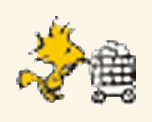
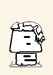
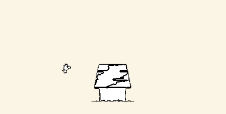
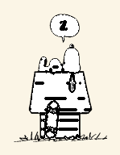

# Snoopy Vertical

Firefox theme based on [Snoopy (animated)](https://addons.mozilla.org/firefox/addon/snoopy-animated/), reworked for vertical tabs (expanded and collapsed) with a comic-strip look.

**[Try it: install in Firefox](https://github.com/danielliew/snoopy-firefox-theme/releases/latest/download/snoopy-vertical.xpi)**

## Showcase

<table>
  <tr>
    <td align="center"><br><sub>Typing, after the reload button</sub></td>
    <td align="center"><br><sub>Woodstock's cart, after the URL bar</sub></td>
    <td align="center"><br><sub>Happy dance, while a page loads</sub></td>
    <td align="center"><br><sub>Asleep, when the window is in the background</sub></td>
  </tr>
  <tr>
    <td align="center"><br><sub>Doghouse, expanded sidebar</sub></td>
    <td align="center"><br><sub>Dozing, expanded sidebar in the background</sub></td>
    <td align="center"><br><sub>Reading, collapsed sidebar</sub></td>
    <td align="center"><br><sub>Joe Cool, while a tab plays sound</sub></td>
  </tr>
  <tr>
    <td align="center"><br><sub>Skating across a new tab</sub></td>
    <td align="center"><br><sub>Skating across a new tab</sub></td>
    <td align="center"><br><sub>Skating across a new tab</sub></td>
  </tr>
</table>

It has two parts:

- **Theme** (the link above): Peanuts colors (paper tab sidebar, inked selected tab and URL bar) and a black-and-white Snoopy animation. Signed by Mozilla and updates automatically.
- **userChrome extras** (optional): CSS for what themes can't do: sprites beside the URL bar, live settings, a Charlie Brown zigzag on the Cmd+F find bar, a Notion-style URL bar, developer signals, matching DevTools, and easter eggs.

Peanuts characters and artwork © Peanuts Worldwide LLC. This is a non-commercial fan project. Animations from the official [Peanuts GIPHY account](https://giphy.com/peanuts): [sleeping](https://giphy.com/gifs/2rJw85F0vFJN0SLn3X), [happy dance](https://giphy.com/gifs/7xIMPoVGL2yzu), [doghouse](https://giphy.com/gifs/SvKTWdJjUDcklNyQ0k), [dozing](https://giphy.com/gifs/FDyb54WxxoKoMm98hG), [reading](https://giphy.com/gifs/C0L6c8KLHAiY0), [Joe Cool's Listening Lounge](https://giphy.com/gifs/JADkTNzBIj1QY4yJgy), skateboarding ([1](https://giphy.com/gifs/29p0L1NemEYmcPZmrZ), [2](https://giphy.com/gifs/LUzkvDDdeB8f8eB2QY), [3](https://giphy.com/gifs/aixTCnT8OrlCOxlBKJ)).

## Install

**Theme:** open the [Try it link](https://github.com/danielliew/snoopy-firefox-theme/releases/latest/download/snoopy-vertical.xpi) in Firefox and click **Add**. If Firefox downloads the file instead, drag `snoopy-vertical.xpi` onto a Firefox window.

**userChrome extras:**

1. Download `userChrome.zip` from the [latest release](https://github.com/danielliew/snoopy-firefox-theme/releases/latest).
2. In `about:config`, set `toolkit.legacyUserProfileCustomizations.stylesheets` to `true`.
3. Open `about:support` → **Profile Folder** → **Show in Finder**, and unzip into a folder named `chrome` there (move any existing `chrome` folder aside first).
4. Restart Firefox (Cmd+Q, then reopen).

## Settings

Themes can't have settings, so the userChrome extras read their own `about:config` prefs and apply changes instantly, no restart needed. In `about:config`, search for the name, choose **Boolean**, click **+**, and set it to `true`:

| Pref | Effect |
| --- | --- |
| `snoopy.animations.slow` | Animations (and the skate ride) play at half speed. |
| `snoopy.animations.paused` | Every sprite holds still, and no skating. |
| `snoopy.easter-eggs.off` | Snoopy keeps typing: no sleeping, dozing, Joe Cool, dancing, or skating. |
| `snoopy.sidebar.hide-scene` | No doghouse or reading Snoopy in the tab sidebar. |

Animations also pause on their own when **Reduce motion** is on (macOS System Settings → Accessibility → Display).

Snoopy sits in the flexible space after the reload button and Woodstock in the one after the URL bar. If your toolbar doesn't have those (Firefox's default layout), they sit on either side of the URL bar instead. To move them, right-click the toolbar → **Customize Toolbar…** and drag in **Flexible Space** items.

## Easter eggs

Need the userChrome extras.

- Snoopy falls asleep on his doghouse when the Firefox window is in the background.
- Snoopy does his happy dance while the current page loads.
- Snoopy becomes Joe Cool, headphones on, while any tab is playing sound (unless it's muted).
- Snoopy skates across each new tab in the expanded sidebar, taking turns between three tricks.
- Snoopy's doghouse sits at the bottom of the expanded tab sidebar, and he dozes off there when the window is in the background.
- Snoopy reads a book at the bottom of the collapsed sidebar.

## Developer features

Also need the userChrome extras.

- **LOCAL tag**: `localhost` and `file://` pages show a yellow ink `LOCAL` tag in the URL bar, so dev and production never look alike.
- **Insecure pages**: plain `http://` sites (and certificate error pages) get a red ink underline on the URL bar.
- **Automation hazard tape**: windows driven by Playwright, Selenium, or Puppeteer get a striped border under the toolbar, so you don't browse in a test window by accident.
- **Container tabs**: a bold color bar with an ink edge on each container tab (works with Multi-Account Containers).
- **Unloaded tabs**: tabs Firefox has unloaded to save memory get a grayed icon and an italic title, so you can see what's actually running.
- **DevTools**: paper backgrounds, ink text and selection, and Woodstock-yellow text highlights in light mode. Dark mode DevTools are unchanged.

## Development

```sh
python3 -m venv .venv
.venv/bin/pip install -r requirements.txt
.venv/bin/python build.py
```

This writes `theme/images/header.png`, the 2x (Retina) animations in `userChrome/assets/` (converted to Notion-style black-and-white line art, with half-speed copies in `slow/` and still frames in `still/`), the README previews in `docs/showcase/`, and `dist/snoopy-vertical.xpi`. Source art lives in `source/`; sizes and frame-rate caps are constants at the top of `build.py`.

Install [oxipng](https://github.com/shssoichiro/oxipng) (`brew install oxipng`) before building; it shrinks the images about 20% further, and the build skips it if it's missing.

Checks (CI runs all three on every push):

```sh
.venv/bin/python build.py --check                 # committed images match the source and stay under the size budgets
npx web-ext lint --source-dir theme --self-hosted  # manifest and theme validation
.venv/bin/pip install marionette_driver && .venv/bin/python tests/verify_userchrome.py
```

`tests/verify_userchrome.py` starts a throwaway headless Firefox with the userChrome extras, checks the computed styles in both toolbar layouts, and flips each setting.

To test the theme without signing: `about:debugging#/runtime/this-firefox` → **Load Temporary Add-on…** → pick `theme/manifest.json`. Click **Reload** there after rebuilding. Temporary add-ons are removed when Firefox restarts.

To work on the userChrome extras, link the repo folder as your profile's `chrome` folder instead of copying it, then restart Firefox after each edit: `ln -s "$PWD/userChrome" "<profile>/chrome"`

## Release

The theme is self-distributed: Mozilla signs it as an unlisted add-on, the signed file is attached to a GitHub release, and installed copies auto-update through `updates.json` (the manifest's `update_url`). Signing needs Node.js (`brew install node`) and an [AMO API key](https://addons.mozilla.org/developers/addon/api/key/). Keep the key out of the repo and chat; export it in your shell only.

1. Bump `version` in `theme/manifest.json` ([semver](https://semver.org); AMO rejects a version it has already signed).
2. Build and lint (`--self-hosted` allows the `update_url`):

   ```sh
   .venv/bin/python build.py
   npx web-ext lint --source-dir theme --self-hosted
   ```

3. Test with **Load Temporary Add-on…** (see above).
4. Sign (takes a few minutes):

   ```sh
   export WEB_EXT_API_KEY='user:…' WEB_EXT_API_SECRET='…'
   npx web-ext sign --source-dir theme --channel unlisted --artifacts-dir dist/signed
   ```

5. Add the new version to the top of the `updates` list in `updates.json`, with `update_link` set to `https://github.com/danielliew/snoopy-firefox-theme/releases/download/vX.Y.Z/snoopy-vertical.xpi`.
6. Commit, tag, and push:

   ```sh
   git add -A && git commit -m "Release vX.Y.Z"
   git tag vX.Y.Z
   git push --follow-tags
   ```

7. Publish the GitHub release. The `.xpi` must be named `snoopy-vertical.xpi` so the Try it link always gets the latest:

   ```sh
   mkdir -p dist/release
   cp dist/signed/*-X.Y.Z.xpi dist/release/snoopy-vertical.xpi
   (cd userChrome && zip -qr ../dist/release/userChrome.zip . -x '.*')
   gh release create vX.Y.Z dist/release/snoopy-vertical.xpi dist/release/userChrome.zip --title "vX.Y.Z" --notes "…"
   ```

Signed files in `dist/` are not committed. Re-download any past signed version from the add-on's page in the [Developer Hub](https://addons.mozilla.org/developers/addons).

Changes under `userChrome/` alone don't need a new signed theme, but publish a release so `userChrome.zip` stays current.
