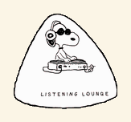
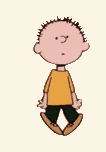
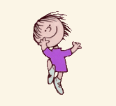
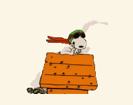
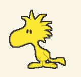
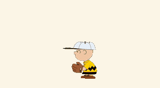
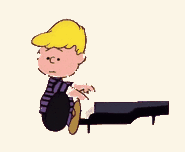
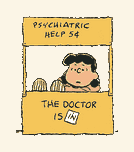

# Snoopy Vertical

Firefox theme based on [Snoopy (animated)](https://addons.mozilla.org/firefox/addon/snoopy-animated/), reworked for vertical tabs (expanded and collapsed) with a comic-strip look.

**[Try it: install in Firefox](https://github.com/danielliew/snoopy-firefox-theme/releases/latest/download/snoopy-vertical.xpi)**

## Showcase

<table>
  <tr>
    <td align="center"><br><sub>Typing, after the reload button</sub></td>
    <td align="center"><br><sub>Woodstock's cart, after the URL bar</sub></td>
    <td align="center"><br><sub>Happy dance, while a page loads</sub></td>
    <td align="center"><br><sub>Asleep, when the window is in the background</sub></td>
  </tr>
  <tr>
    <td align="center"><br><sub>Doghouse, expanded sidebar</sub></td>
    <td align="center"><br><sub>Dozing, expanded sidebar in the background</sub></td>
    <td align="center"><br><sub>Reading, collapsed sidebar</sub></td>
    <td align="center"><br><sub>Joe Cool, while a tab plays sound</sub></td>
  </tr>
  <tr>
    <td align="center"><br><sub>Skating across a new tab</sub></td>
    <td align="center"><br><sub>Skating across a new tab</sub></td>
    <td align="center"><br><sub>Skating across a new tab</sub></td>
  </tr>
  <tr>
    <td align="center"><br><sub>Guitar solo, hidden easter egg</sub></td>
    <td align="center"><br><sub>Joe Cool's Listening Lounge, hidden easter egg</sub></td>
    <td align="center"><br><sub>Charlie Brown dancing, hidden easter egg</sub></td>
    <td align="center"><br><sub>Christmas dancer, hidden easter egg</sub></td>
  </tr>
  <tr>
    <td align="center"><br><sub>Flying Ace, in private windows</sub></td>
    <td align="center"><br><sub>Woodstock chirping, while downloading</sub></td>
    <td align="center"><br><sub>It's getting crowded, on focus at 50+ tabs</sub></td>
    <td align="center"><br><sub>Charlie Brown, on error pages</sub></td>
  </tr>
  <tr>
    <td align="center"><br><sub>Schroeder, beside tabs playing sound</sub></td>
    <td align="center"><br><sub>The Doctor Is In, on the find bar</sub></td>
  </tr>
</table>

It has two parts:

- **Theme** (the link above): Peanuts colors (paper tab sidebar, inked selected tab and URL bar) and a black-and-white Snoopy animation. Signed by Mozilla and updates automatically.
- **userChrome extras** (optional): CSS for what themes can't do: sprites beside the URL bar, live settings, a Charlie Brown zigzag on the Cmd+F find bar, a paper toolbar with a white Notion-style URL bar and menus, the page as a rounded card, Notion-style scrollbars, a Peanuts new tab page, error pages, Reader View, and PDF viewer, developer signals, matching DevTools, and easter eggs.

Peanuts characters and artwork © Peanuts Worldwide LLC. This is a non-commercial fan project. Animations from the official [Peanuts GIPHY account](https://giphy.com/peanuts): [sleeping](https://giphy.com/gifs/2rJw85F0vFJN0SLn3X), [happy dance](https://giphy.com/gifs/7xIMPoVGL2yzu), [doghouse](https://giphy.com/gifs/SvKTWdJjUDcklNyQ0k), [dozing](https://giphy.com/gifs/FDyb54WxxoKoMm98hG), [reading](https://giphy.com/gifs/C0L6c8KLHAiY0), [Joe Cool's Listening Lounge](https://giphy.com/gifs/JADkTNzBIj1QY4yJgy), skateboarding ([1](https://giphy.com/gifs/29p0L1NemEYmcPZmrZ), [2](https://giphy.com/gifs/LUzkvDDdeB8f8eB2QY), [3](https://giphy.com/gifs/aixTCnT8OrlCOxlBKJ)), Christmas dancing ([1](https://giphy.com/stickers/3L9j3SHxQkP1TM2jRJ), [2](https://giphy.com/stickers/aMa2UHCqoReRkwq7wc)), [guitar solo](https://giphy.com/gifs/13YkBrhLJdziXm), [Flying Ace](https://giphy.com/gifs/idM8O5ljn5o40), [Woodstock](https://giphy.com/stickers/jptAHfCnH8rSgVSjcE), [it's getting crowded](https://giphy.com/stickers/Mj6ph7ZnjUfb7NcyUx), [line drive](https://giphy.com/stickers/176RYtzz0pQid77UVA), [Schroeder](https://giphy.com/gifs/m21MSefe0wnHW), [Lucy's booth](https://giphy.com/stickers/XTOMWfzCojbgGOhkic). The code is [MIT licensed](LICENSE); the artwork isn't covered by it.

## Install

**Everything** (macOS or Linux), in Terminal:

```sh
curl -fsSL https://raw.githubusercontent.com/danielliew/snoopy-firefox-theme/main/install.sh | sh
```

The script finds your default profile, moves any existing `chrome` folder to a dated backup, installs the latest `userChrome.zip`, and turns on `toolkit.legacyUserProfileCustomizations.stylesheets`. Then it opens the theme in Firefox: click **Continue to Installation** if asked, then **Add** (Firefox never lets a script turn on an add-on by itself). If Firefox was already open, restart it (Cmd+Q, then reopen) to load the extras.

Run it again to update the extras; the theme updates itself. Options: `SNOOPY_PROFILE=/path/to/profile` for a different profile (prints the theme link instead of opening it), `SNOOPY_SKIP_THEME=1` for the extras only.

**Theme only:** open the [Try it link](https://github.com/danielliew/snoopy-firefox-theme/releases/latest/download/snoopy-vertical.xpi) in Firefox and click **Add**. If Firefox downloads the file instead, drag `snoopy-vertical.xpi` onto a Firefox window.

<details>
<summary>Manual install (or Windows)</summary>

1. Download `userChrome.zip` from the [latest release](https://github.com/danielliew/snoopy-firefox-theme/releases/latest).
2. In `about:config`, set `toolkit.legacyUserProfileCustomizations.stylesheets` to `true`.
3. Open `about:support` → **Profile Folder** → **Open Folder**, and unzip into a folder named `chrome` there (move any existing `chrome` folder aside first).
4. Restart Firefox.

</details>

## Settings

Themes can't have settings, so the userChrome extras read their own `about:config` prefs and apply changes instantly, no restart needed. In `about:config`, search for the name, choose **Boolean**, click **+**, and set it to `true`:

| Pref | Effect |
| --- | --- |
| `snoopy.animations.slow` | Animations (and the skate ride) play at half speed. |
| `snoopy.animations.paused` | Every sprite holds still, and no skating. |
| `snoopy.easter-eggs.off` | Snoopy keeps typing: no sleeping, dozing, Joe Cool, dancing, skating, Flying Ace, chirping Woodstock, crowded sidebar, Schroeder, or Lucy. |
| `snoopy.sidebar.hide-scene` | No doghouse or reading Snoopy in the tab sidebar. |
| `snoopy.color.all` | Every animation in full color instead of black-and-white line art. |
| `snoopy.color.typing`, `.sleeping`, `.dance`, `.reading`, `.doghouse`, `.dozing`, `.skate` | Just that animation in color (for example `snoopy.color.doghouse`). |
| `snoopy.ink.cart` | Woodstock's cart in line art (it's in color by default). |

Joe Cool has no color version because his original art is already black and white. Speed and color settings combine, so a colored doghouse can also be slow or paused.

Animations also pause on their own when **Reduce motion** is on (macOS System Settings → Accessibility → Display).

Snoopy sits in the flexible space after the reload button and Woodstock in the one after the URL bar. If your toolbar doesn't have those (Firefox's default layout), they sit on either side of the URL bar instead. To move them, right-click the toolbar → **Customize Toolbar…** and drag in **Flexible Space** items.

The extras make room on small screens: Woodstock's cart steps aside when the window is under 1000 px wide and Snoopy under 760 px, the sidebar doghouse hides in windows under 640 px tall (Snoopy reading under 480 px), and the doghouse shrinks to fit a narrow sidebar.

## Easter eggs

Need the userChrome extras.

- Snoopy falls asleep on his doghouse when the Firefox window is in the background.
- Snoopy does his happy dance while the current page loads.
- Snoopy becomes Joe Cool, headphones on, while any tab is playing sound (unless it's muted).
- Snoopy skates across each new tab in the expanded sidebar, taking turns between three tricks.
- Snoopy's doghouse sits at the bottom of the expanded tab sidebar, and he dozes off there when the window is in the background.
- Snoopy reads a book at the bottom of the collapsed sidebar.
- Snoopy becomes the World War I Flying Ace, goggles and scarf on, in private windows.
- Woodstock chirps instead of pushing his cart while a download is running (needs the Downloads button in the toolbar, which Firefox shows during downloads).
- With 50 or more tabs open, "it's getting crowded in here" takes over the doghouse for 5 seconds each time the window comes to the front.
- Schroeder plays his toy piano at the end of each expanded tab that's playing sound (he steps aside on hover for the close button, and leaves when the tab is muted).
- Lucy's psychiatric booth stands at the end of the Cmd+F find bar. The Doctor Is In.

## Firefox pages

Also need the userChrome extras. These live in `userContent.css`, since Firefox shows its own pages as content that `userChrome.css` doesn't reach.

- **New tab and home**: paper background in light mode, and Snoopy's doghouse, in full color, in place of the Firefox logo, captioned "a Snoopy Firefox".
- **Error pages** ("Server Not Found", offline, and the like): paper background in light mode, and Charlie Brown getting knocked over by a line drive in place of the fox, captioned "It was a dark and stormy night…"
- **Reader View**: paper and ink in the light color scheme, with Snoopy reading above the title (also on sepia and gray). Dark and custom schemes keep Firefox's colors.
- **PDF viewer**: paper toolbar and sidebar around the white pages in light mode.
- **Menus**: Firefox's own menus (main menu, extensions, downloads) become white Notion popovers with an ink edge. macOS draws right-click and dropdown menus itself, so those stay native.
- **Scrollbars**: thin, Notion warm-gray scrollbars in the browser and on web pages. This is the one thing that reaches websites, and only those that don't style their own scrollbars.

## Developer features

Also need the userChrome extras.

- **LOCAL tag**: `localhost` and `file://` pages show a yellow ink `LOCAL` tag in the URL bar, so dev and production never look alike.
- **Insecure pages**: plain `http://` sites (and certificate error pages) get a red ink underline on the URL bar.
- **Automation hazard tape**: windows driven by Playwright, Selenium, or Puppeteer get a striped border under the toolbar, so you don't browse in a test window by accident.
- **Container tabs**: a bold color bar with an ink edge on each container tab (works with Multi-Account Containers).
- **Unloaded tabs**: tabs Firefox has unloaded to save memory get a grayed icon and an italic title, so you can see what's actually running.
- **DevTools**: paper backgrounds, ink text and selection, and Woodstock-yellow text highlights in light mode; dark mode keeps Firefox's colors. Snoopy types away in black-and-white line art in the toolbox tab bar, next to a blinking cursor (with a thin light outline on dark DevTools). These styles live in `userContent.css`, since Firefox loads DevTools as content pages that `userChrome.css` doesn't reach. The Browser Toolbox (for debugging Firefox itself) uses its own profile, so it isn't styled.

## Requirements and limitations

- **Firefox 137 or newer** for the settings (including ESR 140); built and tested on Firefox 157 with vertical tabs. The theme alone works on any recent Firefox.
- The paper-and-ink colors apply only while Firefox's interface is light, which the Snoopy theme guarantees. With a dark theme, the extras keep the sprites but leave Firefox's colors alone, so nothing turns unreadable.
- Websites still follow your system's dark mode. Their dark-mode favicons (often white) get a thin ink outline so they stay visible on the paper; Firefox's own icons are left alone.
- userChrome.css styles Firefox's internals, which Mozilla doesn't support and can change in any release. CI runs the headless Firefox test against the latest Firefox every week to catch breakage early.
- The installer covers macOS and Linux; Windows uses the manual steps.
- CSS can't tell a brand-new tab from one that reappears, so dragging a tab or expanding a collapsed tab group can replay the skate on those tabs.
- Animated sprites repaint their part of the toolbar continuously. `snoopy.animations.paused` stops that if you're saving battery.

## Development

Uses [uv](https://docs.astral.sh/uv/) (`brew install uv`); it installs Python and the dependencies on first run.

```sh
uv run build.py          # build images, sprites.css, and the unsigned dist/snoopy-vertical.xpi
uv run build.py check    # committed files match the source and stay under the size budgets
uv run build.py bundle   # build, then collect dist/release/ (signed theme + userChrome.zip)
```

`build` writes `theme/images/header.png`, the 2x (Retina) animations in `userChrome/assets/` (converted to Notion-style black-and-white line art, with half-speed copies in `slow/` and still frames in `still/`; color versions in `color/`, and a line-art cart in `ink/`), `userChrome/sprites.css` (the CSS that picks a file for each speed and color setting), the README previews in `docs/showcase/`, and `dist/snoopy-vertical.xpi`. Source art lives in `source/`; sizes and frame-rate caps are constants at the top of `build.py`.

Install [oxipng](https://github.com/shssoichiro/oxipng) (`brew install oxipng`) before building; it shrinks the images about 20% further, and the build skips it if it's missing.

### Automated checks (CI)

GitHub Actions ([`.github/workflows/ci.yml`](.github/workflows/ci.yml)) runs these on every push to `main`, every pull request, every Monday (to catch a new Firefox release breaking userChrome), and on demand from the Actions tab. Public repos run them for free. GitHub pauses the Monday run after 60 days without commits; re-enable it from the Actions tab.

```sh
uv run build.py check                              # committed images and sprites.css match the source; size budgets
npx web-ext lint --source-dir theme --self-hosted  # Mozilla's manifest and theme validation
uv run tests/verify_userchrome.py                  # userChrome in a throwaway headless Firefox
sh -n install.sh                                   # installer syntax only
```

`tests/verify_userchrome.py` starts a throwaway headless Firefox with the userChrome extras three times (default toolbar, flexible spaces, dark mode). It checks computed styles: which sprite shows in each state (typing, sleeping, dancing, Joe Cool, the new-tab skater, Flying Ace, chirping Woodstock, the crowded sidebar, Schroeder, Lucy), every about:config setting, small-window behavior, the paper toolbar, the white URL bar and menus, the rounded page card, DevTools colors and Snoopy, Charlie Brown on error pages, paper Reader View and PDF viewer, and that the collapsed sidebar fits the selected tab's shadow next to a scrollbar.

### Manual checks before a release

CI runs on Linux and reads computed styles, so it can't see how things actually look, macOS rendering, signing, or what the installer actually does. Before publishing a release, check these in real Firefox on a Mac in a throwaway profile, so your own profile stays untouched:

```sh
/Applications/Firefox.app/Contents/MacOS/firefox -CreateProfile snoopy-test
/Applications/Firefox.app/Contents/MacOS/firefox -P snoopy-test --no-remote
```

Find the profile folder in `about:support` → **Profile Folder**, then:

- **Installer**: `SNOOPY_PROFILE="<profile>" sh install.sh` (or `SNOOPY_PROFILE="<profile>" curl -fsSL …/install.sh | sh` for the published copy). Check that it backed up an existing `chrome` folder, added the stylesheets pref to `user.js`, and printed the theme link, then restart Firefox. To check that the theme opens in Firefox, run it once without `SNOOPY_PROFILE` on a machine whose default profile doesn't have the theme yet.
- **Signed theme**: install `snoopy-vertical.xpi` from the release's download link. It should install without an "unverified" warning. After a theme release, an older installed copy should update from **about:addons** → gear → **Check for Updates**.
- **Look**, with System Settings → Appearance → **Show scroll bars: Always**, so the scrollbar takes space as it does with a mouse:
  - Expanded and collapsed sidebar with enough tabs to scroll: the selected tab's border and shadow aren't clipped.
  - URL bar at rest, on hover, focused, and with the results dropdown open.
  - Paper toolbar, rounded page card with the sidebar on the left and right (**Settings** → **Sidebar**), and no paper edge in video fullscreen.
  - Cmd+F find bar zigzag and Lucy's booth, a `localhost` page (LOCAL tag), and an `http://` page (insecure underline).
  - Main menu (☰) popover, Reader View on an article, a PDF, and Schroeder on a tab playing music in the expanded sidebar.
  - DevTools (Cmd+Option+I) docked and in a separate window: paper panels, and typing Snoopy with a blinking cursor in the tab bar.
  - A new tab (doghouse logo on paper; the test can't render the real new tab page), a private window (Flying Ace), a download (chirping Woodstock), and `http://snoopy.invalid` (Charlie Brown's line drive).
  - Compact density (**Customize Toolbar…** → **Density**).
- **Animations**: Snoopy types, then sleeps and the doghouse dozes when another app is focused. He dances while a page loads, Joe Cool takes over while a tab plays sound (and Snoopy returns when it's muted), and the skater rolls across each new tab. Toggle each `snoopy.*` pref in `about:config`; changes apply instantly.
- **Dark mode**: switch macOS to Dark and set Firefox's theme to **System auto** in about:addons. Sprites stay, Firefox's own colors and corners return, and nothing turns unreadable.
- **After a failed Monday run**: a new Firefox renamed or restyled something. Update Firefox locally, rerun `uv run tests/verify_userchrome.py`, and fix the selectors it reports.

Delete the test profile afterwards with `about:profiles`.

To test the theme without signing: `about:debugging#/runtime/this-firefox` → **Load Temporary Add-on…** → pick `theme/manifest.json`. Click **Reload** there after rebuilding. Temporary add-ons are removed when Firefox restarts.

To work on the userChrome extras, link the repo folder as your profile's `chrome` folder instead of copying it, then restart Firefox after each edit: `ln -s "$PWD/userChrome" "<profile>/chrome"`

## Release

The theme is self-distributed: Mozilla signs it as an unlisted add-on, the signed file is attached to a GitHub release, and installed copies auto-update through `updates.json` (the manifest's `update_url`). Signing needs Node.js (`brew install node`) and an [AMO API key](https://addons.mozilla.org/developers/addon/api/key/). Keep the key out of the repo and chat; export it in your shell only.

1. Bump `version` in `theme/manifest.json` ([semver](https://semver.org); AMO rejects a version it has already signed).
2. Build and lint (`--self-hosted` allows the `update_url`):

   ```sh
   uv run build.py
   npx web-ext lint --source-dir theme --self-hosted
   ```

3. Test with **Load Temporary Add-on…** (see above) and go through [Manual checks before a release](#manual-checks-before-a-release).
4. Sign (takes a few minutes):

   ```sh
   export WEB_EXT_API_KEY='user:…' WEB_EXT_API_SECRET='…'
   npx web-ext sign --source-dir theme --channel unlisted --artifacts-dir dist/signed
   ```

5. Add the new version to the top of the `updates` list in `updates.json`, with `update_link` set to `https://github.com/danielliew/snoopy-firefox-theme/releases/download/vX.Y.Z/snoopy-vertical.xpi`.
6. Commit, tag, and push:

   ```sh
   git add -A && git commit -m "Release vX.Y.Z"
   git tag vX.Y.Z
   git push --follow-tags
   ```

7. Bundle and publish the GitHub release. `bundle` copies the signed file for the manifest's version to `dist/release/snoopy-vertical.xpi` (the name the Try it link and installer expect) and zips `userChrome/`:

   ```sh
   uv run build.py bundle
   gh release create vX.Y.Z dist/release/snoopy-vertical.xpi dist/release/userChrome.zip --title "vX.Y.Z" --notes "…"
   ```

Signed files in `dist/` are not committed. Re-download any past signed version from the add-on's page in the [Developer Hub](https://addons.mozilla.org/developers/addons).

Changes under `userChrome/` alone don't need a new signed theme or version bump: go through the manual checks that apply, run `uv run build.py bundle` (it reuses the last signed theme) and publish a release so `userChrome.zip` and the installer stay current.
